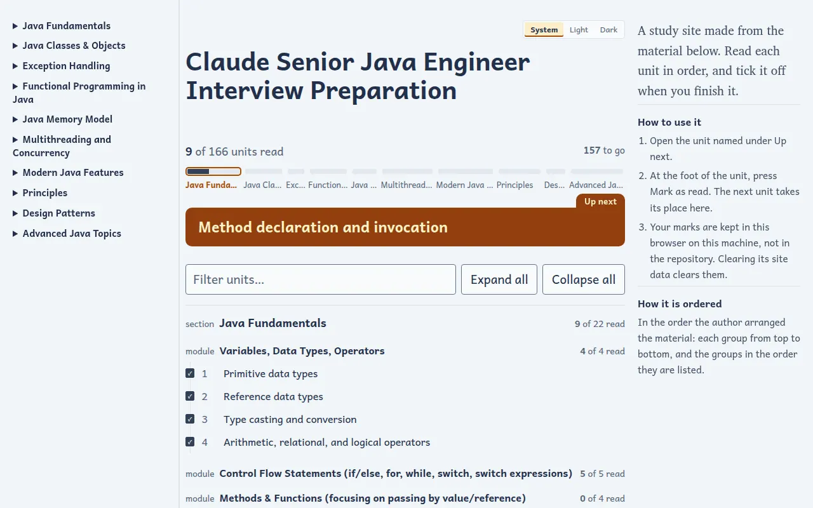
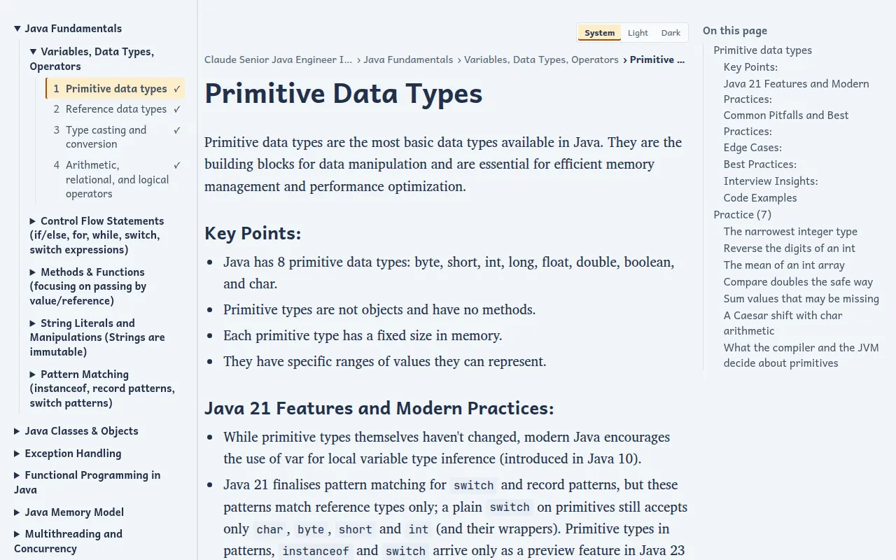
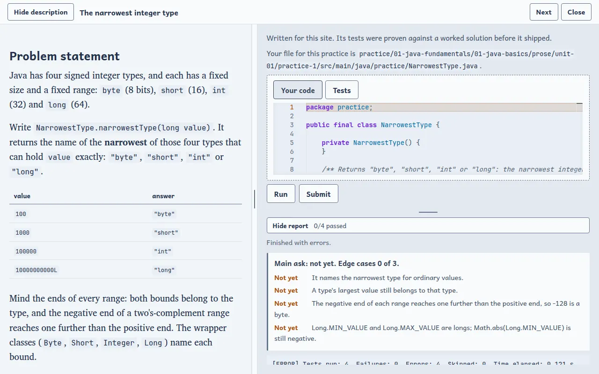
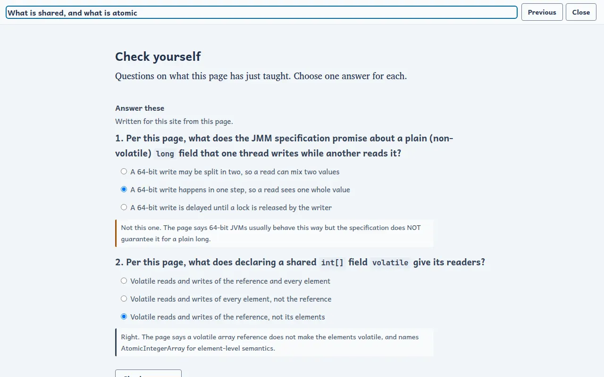
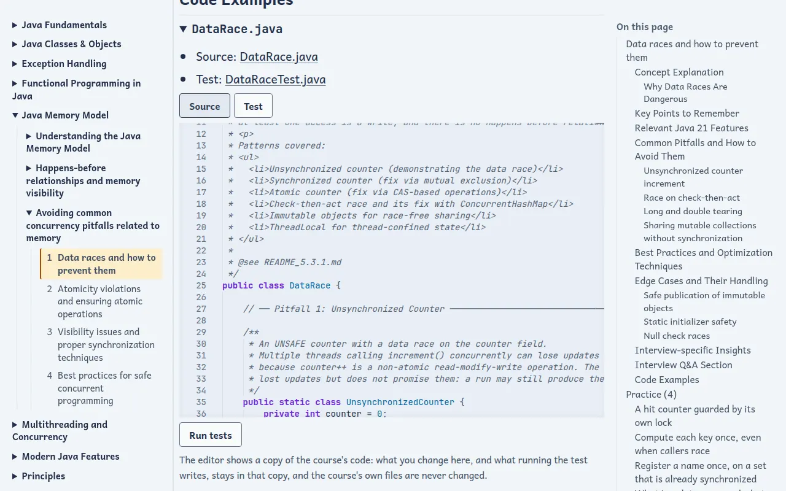
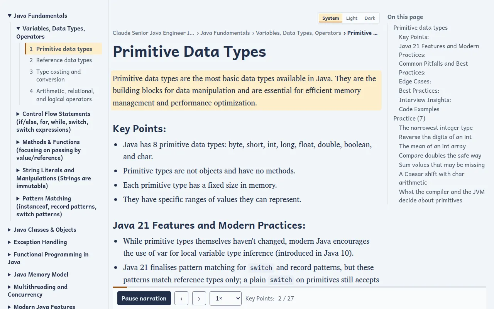

# Claude Senior Java Engineer Interview Preparation

## The course

Claude Senior Java Engineer Interview Preparation is a self-study course: you read its lessons in a browser and work its practices in an editor, on your own machine. A read-only preview of the lessons is online: see the website link at the top of this repository.

It has 166 units in 45 modules, grouped in 10 topic areas: Java Fundamentals, Java Classes & Objects, Exception Handling, Functional Programming in Java, Java Memory Model, Multithreading and Concurrency, Modern Java Features, Principles, Design Patterns and Advanced Java Topics.

It holds 906 practices: 743 to write in code, graded by a real runner, and 163 short quizzes, graded in the page.

## What you get

**Lessons.** Each unit is a page of text and code, with the course contents, an outline of the page and links to the previous and next unit. The index shows what you have read and what comes next, and filters the contents as you type.





**Practices graded by a real runner.** A code practice gives you a statement, starting code and tests. You write your answer in an editor, and **Submit** runs the practice's tests in a runner that has no network. The report says whether the main ask is done and how many edge cases pass, and a practice counts as passed when its tests pass.

**The practice workspace.** Opening a practice fills the window: the statement on the left, the editor on the right, and a report bar below. Drag the dividers to resize the panes. A worked solution is one click away when you are stuck. **Run** tries your code, **Submit** runs the tests.



**Quizzes graded in the page.** A short quiz has a few questions with one answer each. Choose, press **Check answers**, and each choice is explained right or wrong. Nothing is sent anywhere: the page grades it.



**Code examples that open in an editor.** A lesson's example expands in place into the editor, with its source and its test beside the text and a button that runs the test. The editor shows a copy, so the course's own files stay as they are.



**Reading marks and progress.** Mark a unit as read and the index counts it. Your marks and quiz passes are kept in your browser; your practice results are kept on your machine, in a Docker volume.

**Optional narration.** Lessons can be read aloud, the passage being read highlighted, with play and pause, previous and next passage, and speed. Practices and code are not narrated. See [Narration](#narration-optional).



## Two ways to use it

The **read-only preview** is a copy of the lessons on a website: you read, answer the quizzes and keep your reading marks, and everything that needs a server on your machine says so and points here. The **full course** runs on your machine with Docker.

| | Read-only preview | Full course, with Docker |
|---|---|---|
| Set-up | None: open the website link at the top of this repository | Docker, and one command: [Run it locally with Docker](#run-it-locally-with-docker) |
| Lessons, the index and its filter | Yes | Yes |
| Reading marks and progress | Yes, kept in your browser | Yes, kept in your browser |
| Quizzes, graded in the page | Yes | Yes |
| Run and Submit, graded by the runner | No | Yes |
| The editor beside the statement | No | Yes |
| Code examples opened in the editor | No: the files open in the source viewer | Yes |
| Narration | No | Optional |
| Works offline | No | Yes |

## What you need

Docker: Docker Desktop on Windows or macOS, or Docker Engine with the compose
plugin on Linux. Nothing else: no Java, no Python, no other download. What the practices need (Java and Maven) is inside the runner.
A current browser. Your machine needs room for the images, which download once.

## Run it locally with Docker

1. Install Docker, and start it.
2. Clone this repository and open a terminal in its directory.
3. Copy `course.env` to `.env`, and set `STUDYFORGE_NAMESPACE` in it to the Docker Hub
   account you were given: the images are published under that account.

   ```
   cp course.env .env
   ```

   On Windows, use `copy course.env .env`.
4. Start the course from the published images:

   ```
   docker compose -f compose.pull.yaml up -d
   ```

   The first start downloads the images, which takes a while.
   Until `STUDYFORGE_NAMESPACE` is set, compose stops and says so.
5. Open http://127.0.0.1:8772/ in your browser.

The images are built for amd64 (Intel and AMD). On an Apple Silicon Mac they run
under emulation, which is slower.

To build the course's own images from this checkout instead, set
`STUDYFORGE_NAMESPACE` first: the shared base images are pulled from that
account. The first build takes a while, and downloads only those bases and
the course's pinned dependencies:

```
docker compose up -d --build
```

To see what is running: `docker compose -f compose.pull.yaml ps`. Use the same
`-f compose.pull.yaml` with every compose command for the pulled course.

## The ports

| What | Where |
|---|---|
| The study site | http://127.0.0.1:8772/ |
| The editor, which the site opens inside each practice | http://127.0.0.1:8444/ |

Both listen on this machine only. To use other ports, copy `course.env` to
`.env` and change `COURSE_SITE_PORT` and `COURSE_EDITOR_PORT`.

## Where your work is kept

Your answers, your progress and the editor's settings live in Docker volumes,
so they survive a restart. `down` stops the course and keeps them; `down -v`
deletes them too. Every setting is explained in [`course.env`](course.env).

## Narration (optional)

The site is complete without narration: a lesson with no recording shows no
player. The recordings are not stored in this repository, because of their
size: they are assets of this repository's release, and the pulled voiced
site already has them. To hear the lessons read aloud, set
`COURSE_NARRATION=with-narration` in `.env` (copy it from `course.env`), then:

- **Pulled images**: `docker compose -f compose.pull.yaml up -d` pulls the voiced site. Leave the setting as it is for the site without narration.
- **Building it yourself**: download the recordings from the course's release
  first, then build:

```
sh .studyforge/narration-release/restore.sh
docker compose up -d --build
```

  On Windows, run `pwsh .studyforge/narration-release/restore.ps1` instead of the first line.
  The scripts are [`.studyforge/narration-release/restore.sh`](.studyforge/narration-release/restore.sh) and [`.studyforge/narration-release/restore.ps1`](.studyforge/narration-release/restore.ps1).
  The script checks every download and every recording against the checksums
  in this repository before it places anything, and deletes the downloads
  afterwards. Set `NARRATION_LOCAL_DIR` to a directory holding the release's
  volumes to read them from disk instead of downloading them.

## The exercises

`exercises/` holds the course's authored exercises: each one's statement,
starter, tests and reference solution. `practice/` holds your working copy of
each: the files you edit and submit live there, and `exercises/` is only read.

## Stop it

```
docker compose -f compose.pull.yaml down
```

(`docker compose down` stops a course started with the build file.)

## The online preview

The read-only preview is built automatically from `main` on every push, so it is
never out of date, and no other branch holds it. To switch it on for your copy of
this repository, open Settings, then Pages, and choose
"GitHub Actions" as the source. The next push to `main` publishes it, and the
Actions tab can run it by hand. The website link at the top of this repository
opens it. The workflow is [`.github/workflows/pages.yml`](.github/workflows/pages.yml).

## Licence

The course's licence is in [`LICENSE`](LICENSE).

## How this course was built

How it was built lives on the `studyforge/build` branch; you do not need it.
